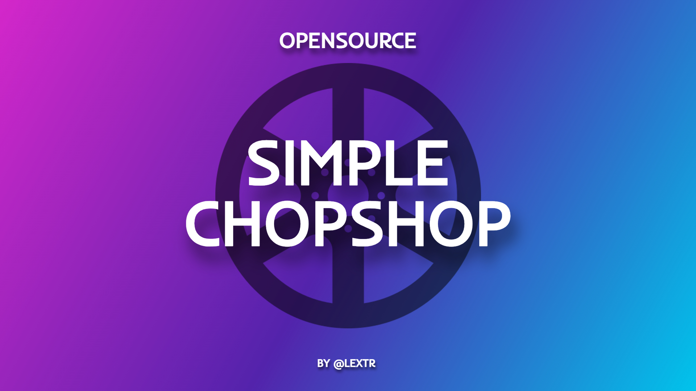

  

# 🔧 QBOX Chop Shop System

A simple chop shop system for FiveM servers running the QBOX framework. Players can bring stolen vehicles to designated locations to break them down for valuable car parts and materials.

## ✨ Features

### 🚗 **Vehicle System**
- **Class-based Filtering**: Configurable vehicle classes (compacts, sedans, sports, etc.)
- **Ownership Protection**: Prevents chopping of player-owned vehicles

### 👔 **Job Integration**
- **Flexible Job Requirements**: Optional job restrictions
- **Multi-job Support**: Allow specific jobs (mechanic, criminal, etc.)

### ⏰ **Advanced Cooldowns**
- **Per-player Cooldowns**: Individual player restrictions
- **Global Cooldowns**: Server-wide chopping limits (optional)
- **Configurable Duration**: Customizable cooldown periods

### 🎁 **Dynamic Reward System**
- **Three Tier Rewards**: Common, uncommon, and rare items
- **Chance-based Distribution**: Configurable drop rates
- **Random Quantities**: Min/max amount ranges

### 🗺️ **Multi-location Support**
- **Multiple Chop Shops**: Support for various locations
- **Flexible Zones**: Customizable interaction radius
- **Optional Blips**: Configurable map markers
- **Easy Expansion**: Simple location addition

## 📋 Requirements

| Dependency | Version | Required |
|------------|---------|----------|
| [qbx_core](https://github.com/Qbox-project/qbx_core) | Latest | ✅ |
| [ox_lib](https://github.com/overextended/ox_lib) | Latest | ✅ |
| [ox_inventory](https://github.com/overextended/ox_inventory) | Latest | ✅ |

**⭐ If you found this resource helpful, please give it a star! ⭐**

Made with ❤️ for the FiveM community

